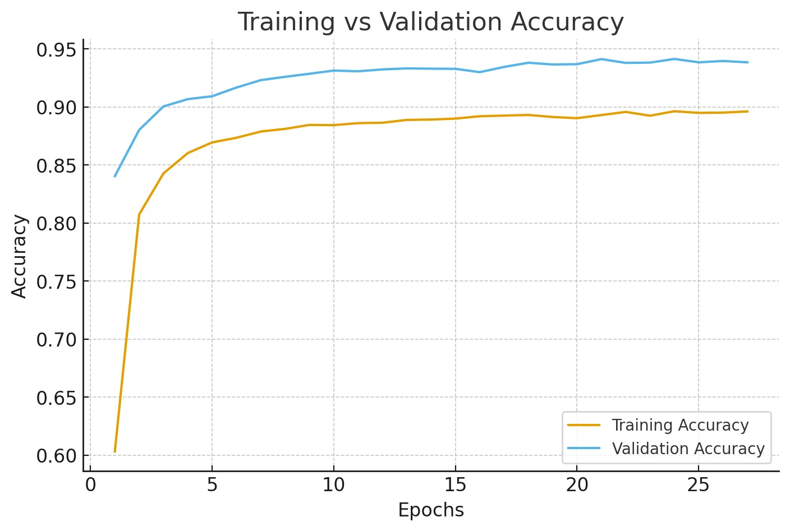
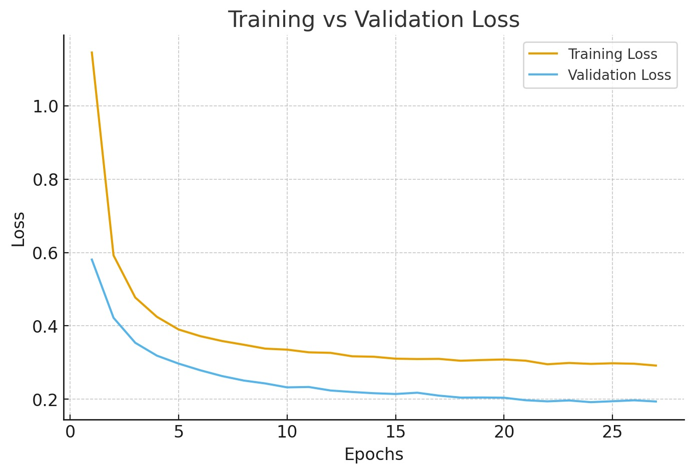

# 🌿 Mango Leaf Disease Detection Dashboard

This project provides an interactive dashboard for detecting plant diseases in images. It combines a React-based frontend with a Flask-based backend and a TensorFlow model for image prediction. Users can upload images through the frontend, which are then sent to the backend for processing. The backend uses a pre-trained TensorFlow model to predict the disease and returns the results to the frontend for display. The dashboard also features a dark mode toggle and displays the backend server status.

## 🚀 Key Features

- **Image Upload**: Allows users to upload images for disease prediction.
- **Disease Prediction**: Uses a TensorFlow model to predict plant diseases from uploaded images.
- **ESP32 Companion Mode**: Optionally fetches temperature and humidity data from an ESP32 companion device by IP address.
- **Advanced Two-stage Pipeline**: Uses YOLO to detect and crop the mango leaf, then classifies the cropped leaf with a CNN.
- **Intel CPU Mode**: Runs on Intel-compatible TensorFlow/CPU mode without requiring NVIDIA CUDA.
- **Real-time Results**: Displays prediction results, including class name and confidence level, in real-time.
- **Backend Status**: Monitors and displays the status of the backend server.
- **Dark Mode**: Offers a dark mode option for improved user experience.
- **API Endpoints**: Provides `/predict` endpoint for standard image prediction, `/alt-predict` for advanced YOLO + CNN detection/classification, and `/` endpoint for server status.
- **CORS Enabled**: Allows requests from different origins (frontend and backend).
- **Model Training**: Includes scripts for training the TensorFlow model with data augmentation and class weighting.

## 🛠️ Tech Stack

- **Frontend**:
    - React
    - Vite
    - Tailwind CSS
    - React Icons
    - JavaScript (ES Modules)
- **Backend**:
    - Flask
    - Python
    - TensorFlow (Intel CPU / CPU-only inference)
    - Keras
    - Pillow (PIL)
    - Flask-CORS
- **AI Model**:
    - DenseNet121/DenseNet169
- **Build Tools**:
    - npm
 
## ⚙️ Model Metrics




## 📦 Getting Started

### Prerequisites

- Node.js (v18 or higher)
- Python (v3.12)
- pip (Python package installer)
- npm (Node package manager)

### Installation

## Windows

1. Run `Prerequisites.bat` to install all dependencies.
2. Run the Server using `Run.bat`.

 Alternatively can also follow linux installation process.


## Linux 

**Frontend:**

1.  Navigate to the `frontend` directory:

    ```bash
    cd frontend
    ```

2.  Install the dependencies:

    ```bash
    npm install
    ```

**Backend:**

1.  Navigate to the `backend` directory:

    ```bash
    cd backend
    ```

2.  Create a virtual environment (recommended):

    ```bash
    python -m venv venv
    source venv/bin/activate  # On Linux/macOS
    venv\Scripts\activate  # On Windows
    ```

3.  Install the dependencies:

    ```bash
    pip install tensorflow numpy flask flask-cors pillow
    ```

    > Note: This project is configured for Intel CPU mode and does not require NVIDIA CUDA or GPU drivers.

### Running Locally

**Frontend:**

1.  Navigate to the `frontend` directory:

    ```bash
    cd frontend
    ```

2.  Start the development server:

    ```bash
    npm run dev
    ```

    This will start the Vite development server, usually on `http://localhost:5173`.

**Backend:**

1.  Navigate to the `backend` directory:

    ```bash
    cd backend
    ```

2.  Run the Flask application:

    ```bash
    python app.py
    ```

    This will start the Flask server, usually on `http://127.0.0.1:5000`.

## 💻 Usage

1.  Ensure both the frontend and backend servers are running.
2.  Open the frontend URL (usually `http://localhost:5173`) in your browser.
3.  Upload an image using the "Choose File" button.
4.  The prediction result will be displayed in the `ResultCard` component.
5.  The backend status will be displayed in the `BackendStatus` component.
6.  Toggle dark mode using the switch in the `Navbar`.
7.  Enable **Advanced Mode** to use a two-stage pipeline: first YOLO leaf detection, then CNN classification on the detected leaf crop.

### Companion Mode (ESP32)

1.  In the image upload area, enable **Companion Mode**.
2.  Enter the IP address of your ESP32 companion device.
3.  Upload the mango leaf image.
4.  The app will fetch temperature and humidity data from the ESP32 at `http://<COMPANION_IP>/data` and include it with the prediction.
## 🤝 Contributing

Contributions are welcome! Please follow these steps:

1.  Fork the repository.
2.  Create a new branch for your feature or bug fix.
3.  Make your changes and commit them with descriptive messages.
4.  Push your changes to your fork.
5.  Submit a pull request.

## 📝 License

This project is licensed under the MIT License - see the [LICENSE](LICENSE) file for details.
